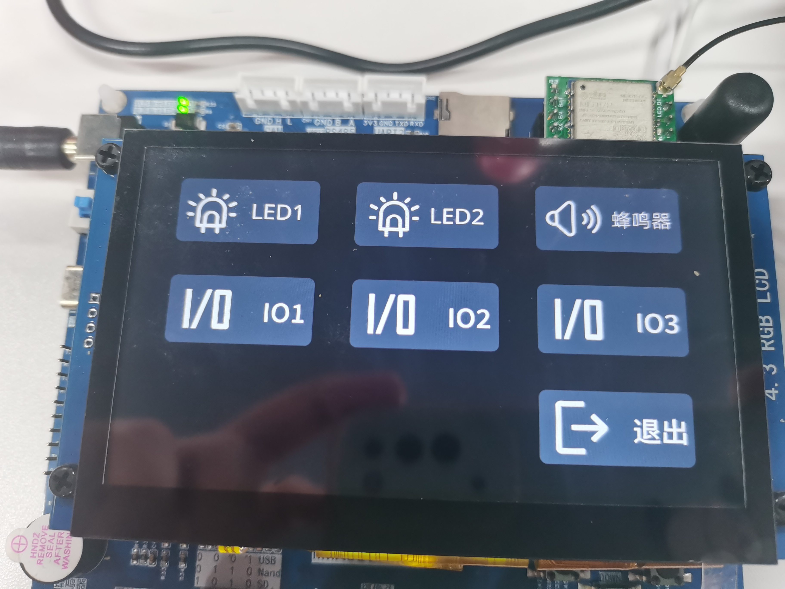

本项目基于imx和qt完成，文件基本已上传，其中buildroot的output存放位置：

通过网盘分享的文件：Micro-output.zip
链接: https://pan.baidu.com/s/1uoGvOkI1VjXaOIMWueVT-Q?pwd=z7gg 提取码: z7gg

具体的app应用全部存放于desktop内，source存放脚本文件，Show文件夹内存放完成品的各功能展示和图片，固件下载使用UUU工具

  
  
  
  
  
  
  
  
